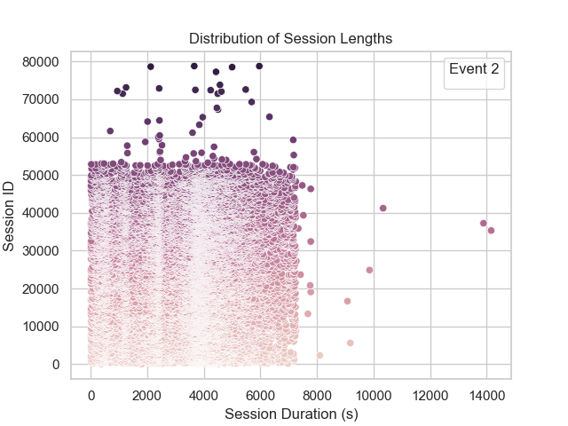

# Streaming Dataset Analysis
Further analysis of the Streaming Dataset paper

## Running the code

```bash
$ python3 -m venv myvenv
$ source myvenv/bin/activate
$ pip install -r requirements.txt
$ python main.py
```

The code outputs the distribution of session durations for a specific event (event 2 in this case).


